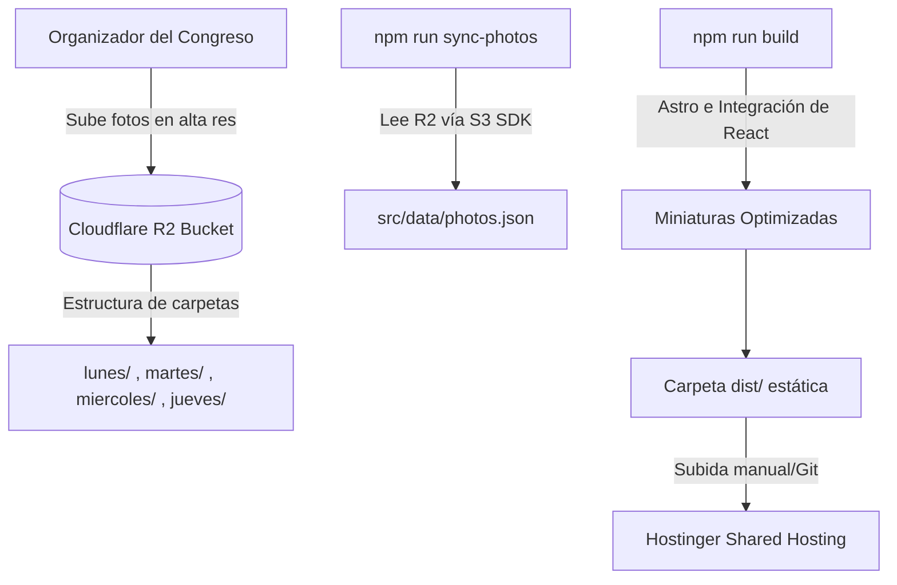

# Plan de Diseño y Desarrollo: Galería de Fotos UNBJ

Este documento presenta la arquitectura técnica, el diseño de la interfaz (UI/UX) y el plan de implementación detallado para agregar la sección de fotos del congreso (Lunes a Jueves) en la landing page de **UNBJ — Un Latir por el Reino**.

Este plan está estructurado para que el diseñador/desarrollador (Pencil) pueda iniciar la ejecución de inmediato con total claridad.

---

## 1. Arquitectura Técnica y Flujo de Datos

Para soportar **más de 500 fotos por día** (más de 2,000 fotos en total) con descargas en alta resolución y sin costos de servidor, la arquitectura seleccionada es la siguiente:



### Componentes de Datos:
1. **Almacenamiento (Cloudflare R2)**:
   - Se utilizará Cloudflare R2 debido a su modelo de **$0 de costo de transferencia (Zero Egress Fees)**. Esto permite descargas ilimitadas de fotos en alta resolución por parte de los asistentes sin generar cobros.
   - Organización en R2:
     ```text
     unbj-photos/
     ├── lunes/
     │   ├── foto-001.jpg
     │   └── ...
     ├── martes/
     │   └── ...
     ├── miercoles/
     │   └── ...
     └── jueves/
         └── ...
     ```
2. **Sincronización (Script Node.js)**:
   - Un script `scripts/sync-photos.js` que utiliza el SDK de AWS S3 (compatible con Cloudflare R2) para listar los objetos del bucket y guardar sus URLs originales y estructura en `src/data/photos.json`.
3. **Compilación (Astro Build)**:
   - Durante `npm run build`, Astro procesará los metadatos y generará las miniaturas optimizadas para la galería, garantizando que el usuario inicial no descargue imágenes pesadas de 5MB-10MB al navegar.

---

## 2. Diseño de la Interfaz (UI/UX)

### A. Sección en la Landing Page (Resumen y Accesos)
Ubicada al final de la landing page actual, manteniendo la estética elegante y minimalista.

* **Título**: `Galería de Fotos` (en tipografía *Playfair Display*, cursiva, centrado).
* **Control de Días**: Un set de pestañas estilizadas (Tabs) para **Lunes**, **Martes**, **Miércoles** y **Jueves**.
* **Vista Previa (Collage)**: Al seleccionar un día, se muestra una vista previa dinámica de **6 a 8 fotos destacadas** en un diseño de cuadrícula (grid) asimétrica y elegante.
* **Llamado a la Acción (CTA)**: Un botón con el estilo del sitio (borde negro, texto centrado, hover con fondo claro/rojo) que dice:
  `Ver todas las fotos del Lunes (+500 fotos) →`
  Este botón redirige a la subpágina dedicada de ese día.

### B. Subpáginas de Galería por Día (`/fotos/[dia]`)
Páginas dedicadas para manejar el alto volumen de imágenes de forma fluida.

* **URL Estructurada**: `/fotos/lunes`, `/fotos/martes`, `/fotos/miercoles`, `/fotos/jueves`.
* **Encabezado**:
  - Botón de retorno destacado: `← Volver a la página principal` (en la esquina superior izquierda).
  - Título grande: `Fotos del Lunes` (con la fecha del congreso).
* **Grid de Fotos (Masonry / Flex Grid)**:
  - Una cuadrícula responsiva (3 columnas en móvil, 4-5 en desktop).
  - Carga diferida (**Lazy Loading**) y **Paginación o Scroll Infinito** controlado en React para no saturar la memoria del navegador.
  - Cada tarjeta de foto muestra una miniatura optimizada y al hacer *hover* (en desktop) se revela un botón de lupa (ampliar) y un botón de descarga directa.

### C. Visualizador de Pantalla Completa (React Lightbox)
Un modal interactivo premium optimizado para móviles y desktop.

* **Backdrop**: Fondo negro translúcido (`rgba(28, 28, 28, 0.95)`) para aislar la foto y hacer que los colores resalten.
* **Visualización de Foto**: Imagen centrada con soporte de carga progresiva.
* **Navegación**:
  - Botones de flecha izquierda/derecha flotantes a los lados (en desktop).
  - Soporte de gestos táctiles (**Swipe left/right**) en móvil para pasar de foto de manera fluida.
  - Teclas de dirección (flechas del teclado) y `Esc` para cerrar en desktop.
* **Barra de Acciones Inferior**:
  - Contador: `Foto 42 de 512`.
  - Botón destacado de **"Descargar Original"** (icono de descarga + texto claro).
  - **Mensaje de ayuda en móviles (iOS/Android)**: Un texto sutil abajo del botón:
    > [!TIP]
    > **Tip para móvil:** Mantén presionada la foto para guardarla directamente en tu app de Fotos/Carrete.

---

## 3. Especificaciones de Diseño Visual (CSS y Tokens)

La galería debe integrarse perfectamente con el sistema de diseño existente en [index.astro](file:///Users/raulcanul/Documents/Dev/unbj-page/src/pages/index.astro):

* **Fondo general**: `var(--bg-cream)` (`#E9E7E1`).
* **Textos principales**: `var(--text-dark)` (`#1C1C1C`).
* **Tipografías**:
  - Títulos y fechas: `'Playfair Display', Georgia, serif`
  - Contadores, botones y UI: `'Inter', sans-serif`
* **Acentuación**: `var(--accent-red)` (`#D85446`) para elementos interactivos activos o hover de descarga.
* **Bordes y Líneas**: `1px solid rgba(28, 28, 28, 0.15)`.

---

## 4. Plan de Implementación Paso a Paso

### Paso 1: Configuración de Cloudflare R2
- [ ] Crear el bucket `unbj-photos` en el panel de Cloudflare.
- [ ] Configurar las políticas de **CORS** del bucket para permitir lecturas y descargas desde el dominio del sitio web y desde `localhost:4321`.
- [ ] Generar las credenciales de API (Access Key ID y Secret Access Key) con permisos de lectura.

### Paso 2: Script de Sincronización
- [ ] Instalar la dependencia de cliente S3: `npm install @aws-sdk/client-s3`.
- [ ] Crear el archivo [sync-photos.js](file:///Users/raulcanul/Documents/Dev/unbj-page/scripts/sync-photos.js).
- [ ] Configurar variables de entorno locales (`.env`) con las credenciales de R2.
- [ ] Escribir la lógica para listar objetos organizados en carpetas y guardar el resultado en `src/data/photos.json`.

### Paso 3: Componentes React de la Galería
- [ ] Crear un componente `GalleryGrid.jsx` que lea la lista de fotos y maneje la paginación/scroll infinito.
- [ ] Crear un componente `Lightbox.jsx` con soporte para gestos táctiles (usando librerías ligeras o lógica nativa de `onTouchStart`/`onTouchMove`) y navegación por teclado.
- [ ] Diseñar el comportamiento de descarga forzada para evitar que se abra en pestaña (configuración de headers en R2 o enlace de descarga con trigger de blob).

### Paso 4: Creación de las Subpáginas en Astro
- [ ] Configurar la ruta dinámica `src/pages/fotos/[dia].astro` para renderizar el layout crema, el botón de retorno y el componente `GalleryGrid` de React con la directiva `client:load` para habilitar la interactividad.

### Paso 5: Actualización de la Landing Page Principal
- [ ] Modificar [index.astro](file:///Users/raulcanul/Documents/Dev/unbj-page/src/pages/index.astro) para añadir la sección "Galería de Fotos".
- [ ] Agregar el componente de pestañas (Tabs) de los días con la previsualización del collage (6-8 fotos estáticas cargadas rápidamente) y el botón que redirige a la subpágina correspondiente.

### Paso 6: Ajustes en los Comandos de Compilación
- [ ] En `package.json`, añadir el script `"sync-photos": "node scripts/sync-photos.js"`.
- [ ] Modificar el comando build para mayor seguridad o documentar el flujo de despliegue para Hostinger:
  1. Ejecutar `npm run sync-photos` (descarga las últimas URLs).
  2. Ejecutar `npm run build` (compila las páginas estáticas y optimiza).
  3. Comprimir `dist` a `dist.zip` y subir a Hostinger.

---

## 5. Diseño Mockup Conceptual (Instrucciones para Pencil)

Para la maquetación visual en CSS, Pencil debe estructurar los siguientes layouts principales:

### Collage de la Landing Page (Vista Previa)
```text
+-------------------------------------------------------+
|                 *Galería de Fotos*                    |
|                                                       |
|    [ Lunes ]   [ Martes ]   [ Miércoles ]   [ Jueves ]|
|                                                       |
|  +--------------------+  +-------------------------+  |
|  |     Foto 1         |  |        Foto 2           |  |
|  |     (Grande)       |  |      (Mediana)          |  |
|  +--------------------+  +-------------------------+  |
|  |     Foto 3         |  |  Foto 4  |   Foto 5     |  |
|  |    (Mediana)       |  |  (Mini)  |   (Mini)     |  |
|  +--------------------+  +----------+--------------+  |
|                                                       |
|       [ Ver todas las fotos del Lunes (500+ fotos) ]  |
+-------------------------------------------------------+
```

### Visualizador Lightbox (Pantalla Completa)
```text
+-------------------------------------------------------+
|  [X] Cerrar                                           |
|                                                       |
|                     IMAGEN AMPLIA                     |
|                    EN ALTA CALIDAD                    |
|                                                       |
|   < Anterior                               Siguiente >|
|                                                       |
|   -------------------------------------------------   |
|   Foto 42 de 512              [ Descargar Original ]  |
|   *Tip: Mantén presionado para guardar en tu carrete*  |
+-------------------------------------------------------+
```

---

> [!NOTE]
> Este plan asegura una experiencia de carga instantánea en Hostinger, almacenamiento rentable en Cloudflare R2 y una interacción táctil fluida en dispositivos móviles de los asistentes.
